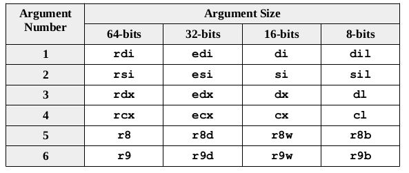
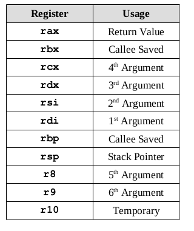
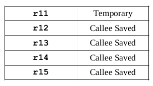

#### `Functions`
- Help break programs into smaller parts making it easier to code,debugged and maintain
- Involve 2 main actions:<br>
(i) Linkage<br>
(ii) Argument transition<br>

#### `Functions Declaration`
- Declared using the general form:
```
global <procName>
<procName>:

    ;function body

ret
```
- A function may only be declared only once by convection

#### `Linkage`
- The linkage is about getting to and returning from a function call correctly
- Handled by 2 functions namely: **call <funcName>** and **ret** Instructions
- **call** calls a functions and saves where to return after a function completes
- Places contents of rip register on stack.(rip points to next instruction to be executed which in this case is instruction after call)
- **ret** is used in a procedure to return
- it pops current top of stack(rsp) into rip register thus appropriate return address is restored<br>
i.e.
```
call printString
ret
```

#### `Parameter passing`
- A combination of registers and the stack is used to pass parameters to and/or from a function
- First 6 arguments are passed into registers as follows:

- The seventh and any other arguments are passed on into the stack
- Floating point registers **xmm0** to **xmm1** are used in that order for the first eight float arguments
- When pushing arguments into stack, they are pushed in reverse order i.e. numberFunc(one, two, three) would be pushed from three, then two then one)
- The calling routine is responsible for clearing items from stack once function execution is completed
- Instead of doing a series of pop instructions, the
stack pointer, rsp, is adjusted as necessary to clear the arguments off the stack

#### `Register usage`
- Table below summarizes register usage:
<br>
<br>
- The temporary registers (r10 and r11) and the argument registers (rdi, rsi, rdx, rcx, r8, and r9) are not preserved across a function call and thus may be used without preserving original value

#### `Call frame`
- Items on stack as part of a function are called call frames
- Possible items include:

- [x] Return address(required)

- [x] Preserved registers(required)

- [x] Passed arguments(if any)

- [x] Stack dynamic local variables(if any)

- For some functions, a full call frame may not be required if function:<br>
(i) Does not call another function(is a leaf function)<br>
(ii) Passes its arguments only in registers(does no use the stack)<br>
(iii) Does not alter any of the saved registers<br>
(iv) Does not require stack based local variables <br>

#### `Red zone`
- In linux standard calling convection, the first 128 bytes after stack pointer **rsp** are reserved
- This red zone may be used by the function without any adjustment to the stack pointer.
- The purpose is to allow compiler optimizations for the allocation of local variables.
- It doesn't directly impact programs written directly in assembly language.

#### `Caller`
- A snippet of assembly language code in the calling routine for the call to the stats function would be as follows:
```
; stats1(arr,len,sum,ave);
mov   rcx, ave          ;4th arg, address of ave
mov   rdx, sum          ;3rd arg, address of sum
mov   esi, dword [len]  ;2nd arg, value of len
mov   rdi, arr          ;1st arg, address of arr
call  stats1
```
- no specific required order for setting the argument registers
- No return value is provided by the void routine
- If function was a value returning function, the value returned would be in the **A** registers
