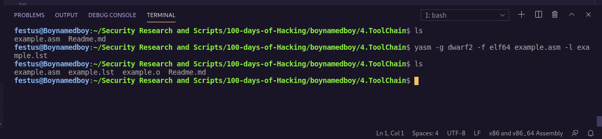
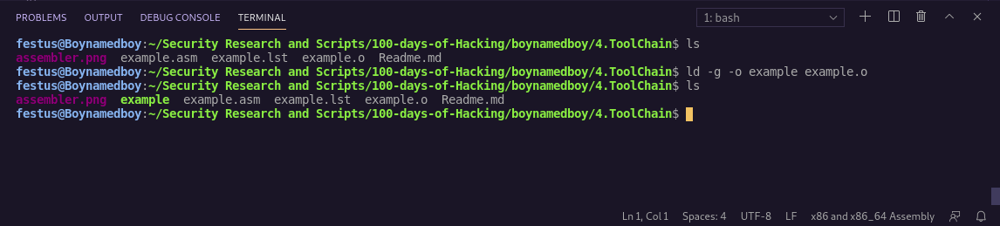
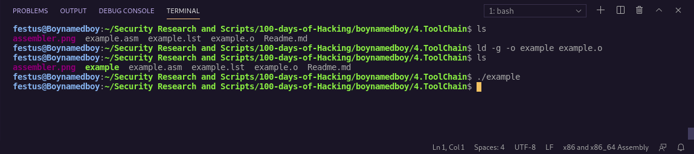

#### `Tool Chain`
- Set of Programming tools used to create a program: 
(i) Assembler 
(ii) Loader 
(iii) Linker 
(iv) Debugger 
#### Assemble Overview
- Human readable source file is converted into an object file by assembler then object file converted into an executable file by linker.
- Loader will then loader executable file into memory.

#### `Assembler`
- Is a program that will read an assembly language input source file and convert it into machine language binary file.
- Input file contains Instructions that can be read in human form.
-  Machine language binary file(output) = object file.
- At this point, comments are removed, variable names and labels converted into appropriate addresses as required during cpu execution.
- Examples of assemblers: nasm, yasm, etc
#### Assembling
- We are using yasm: 
<t><t><t><i>yasm -g dwarf2 -f elf64 example.asm -l example.lst</i> 
- manual:
 
(i) -g dwarf2 -> include debugging symbols in final object file (necessary for debugging) 
(ii) -f elf64 -> create object in elf64 format(64bit) 
(iii) -l example.lst -> create a list file named example.lst
#### List File
- Shows line number, relative address, machine language version of instructions and original source line
- Useful while Debugging
- Lable last does not have a machine language instruction since label is used to reference a specific address and not an instruction
#### Two pass assembler
#### First pass
- Based on design of specific assembler
- Include: 
(i) Create symbol table(listing of all variable names, program symbols, labels and respective addresses in program) 
(ii) Expand Macros-(program elements) 
(iii) Evaluate constant expressions(expression composed entirely on constants) 
#### Second pass
- Vary depending on assembler used
- Include: 
(i) Final generation of code(from assembly to cpu executable machine instructions) 
(ii) Creation of list file if requested 
(iii) Creation of object file
#### Assembler Directives
- Instructions directing assembler to do something. Not converted to instructions for the cpu

#### `Linker`
- Combines one or more object into a single executable file
- Routines from user or system libraries are added if necessary.
- GNU Gold Linker example:
<t><t><t>ld -g -o example example.o 
-manual:
 
(i) -g -> include debugging info in final executable file 
(ii) -o -> specifies name of final executable file to be produced from object file. if omitted default output name will be a.out 
#### Linking multiple files
- Additional input object files would be listed in order having a space between them e.g. 
<t><t><t>ld -g -o example.a main.o example.o 
#### Linking Process
- Is combining smaller solutions into a single executable unit
- Machine code is copied from single object into a single executable.
- Linker must adjust relocatable addresses as necessary.
#### Dynamic Linking
- Allows for postponement of resolution of some symbols till program is executed.
- Actual instructions not placed in executable file and instead, resolved and accessed during runtime
- Dynamically linked objects have a .so extension in linux and a .dll extension in windows(so-shared object, dll-dynamically linked library)

#### `Loader`
- Is part of operating system that will load program from secondary storage to primary storage(e.g. main memory)
- It attempts to find and if found, read a properly formatted executable file, creates a new process, and loads code into memory and marks program ready for execution
- Operating system scheduler will then make decisions about which process is executed.
- Invoked by typing program name after ./ e.g: 
<t><t><t>./Examples

-Our program has no displaying of results thus we will use a debugger.

#### `Debugger`
- Used to control execution of program to allow testing and debugging
- Our program was created using the -g command to allow for inclusion of debugging info and since our program does not display any output we shall use the debugger for its testing.
- Debugger to be used will be the DDD Debugger
