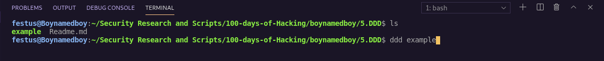
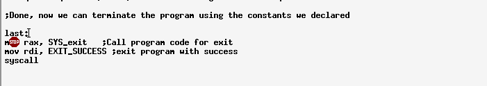
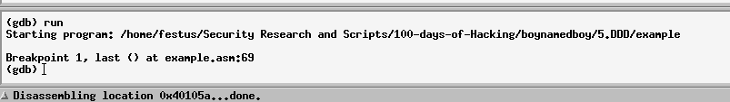
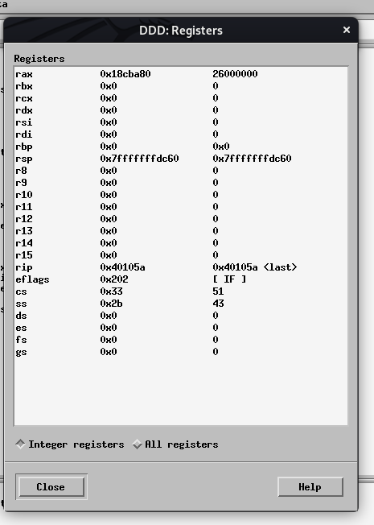

#### `DDD Debugger`
- A debugger allows on to control execution of a program, examine variables, memory such as stacks, and display program output if any.
- DDD offers a gui for gdb debugger.
- Start it by writing ddd followed by name of program you want to examine:e.g. 
<t><t>ddd example 

- For gdb execute: 
<t><t>gdb example

#### `Program execution with ddd`
- Click run button found on the command line menu or type run at the bottom gdb prompt.
- This however has an effect of running the program entirely and progress will be lost thus the need to set breakpoints
#### Setting Breakpoints
- This is necessary to control program execution.
- Can be done in 3 ways: 
(i) Right click line number and click set breakpoint 
(ii) in gdb console, type: break last 
(iii) in gdb console, type break 64(for exmple line 63 is a label with no instruction, it will stop at the next instrucion - line i.e. in line 64)

- You can set multiple breakpoints if desired
#### Executing programs
- Once breakpoint is set, you can run program by clicking Run or typing run at the gdb prompt at the bottom.
- Program will run but will not go past breakpoint.

#### Run/continue
- If you had set multiple breakpoints, you can run the following after reaching the first breakpoint: 
(i) Click Cont on menu window or type cont on gdb prompt - This runs the program until the next breakpoints
(ii) Click Step or Next or alternatively type step or next on gdb prompt - This runs/executes the program, line by line after the breakpoint
- Next command executes the next instruction(entire function if necessary)
- Step command executes only one step ahead
- NO difference between the two for a single non-function instrucion
#### Displaying Register Contents
- Click status from menu bar, then registers
- Will show register Contents by register boynamedboy
- rsp and rbp registers are shown as hex since they are typically used for addresses.

#### `ddd | gdb commands`
- quit -> quit the Debugger
- break -> set a breakpoint
- run -> execute the program to first breakpoint or whole program if breakpoint not set
- continue -> continue excution after breakpoint
- step -> Execute the next instruction(entire function if necessary)
- next -> step though preocdeure calls(only one step ahead)
- F3 -> restart program
- where -> Current activation / get the call depth
- x/<n><f><u> $rsp -> examine contents of stack
- x/<n><f><u> &<variable> -> Examine memory location of <variable>
explanation here: 
(i) <n> -> number of locations to display 
(ii) <f> -> format: d - decimal, x - hex, u - decimal, c - Character, s - string, f - floating point 
(iii) <u> -> unit size: b - byte, h - halfword(16bits), w - word(32 bits), g - giant(64 bits) 
- source <filename> -> Read commands from files
- set logging file <filename> -> set logging file to <filename>, default is gdb.Text
- set logging on -> Turn logging to a file on
- set logging off -> Turn logging to a file off
- set logging overwrite -> when logging to a file is turned on, overwrite previous file if any.

#### `Displaying stack contents`
- Stack is normally comprised of 64 bit unsigned elements
- Examine command is used however address is in the rsp(stack based pointer) register.
- To display contents of top of stack use:
<t><t>x/ug $rsp 
- Likewise, to display top 6 items on stack use:
<t><t>x/6g $rsp 
- First item shown, is the one on top of stack(from how stacks implementation)

#### Debugger commands File(non-interactive)
-  Debugger command to read a file is the: source <filename>e.g. 
<t><t>(gdb) source gdbIn.txt 

- To obtain output file without an interactive DDD session, use following command at command line 
<t><t>gdb < gdbIn.txt prog 
- Basically, it will execute command in input file on given program, create output file and finally exit the program and debugger-
