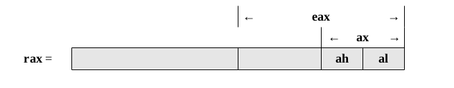
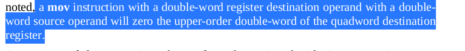
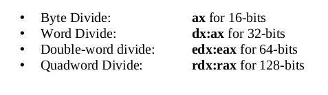

#### `Instruction Set Overview `
- Instructions to deal with:<br>
<p>(i) Data movement<br></p>
<p>(ii) Conversion Instructions<br></p>
<p>(iii) Arithmetic Instructions<br></p>
<p>(iv) Logical Instructions<br></p>
<p>(v) Control Instructions<br></p>

#### `Notational Convections`
#### Notational Operand
- An instruction consists of instruction or operation it will do plus the operands(where data going to be operated on comes from / or where its going to be placed)
- Their summary include:<br>
```
<reg> -> Register operand. operand must be a Register
<reg8>, <reg16>, <reg32>, <reg64> -> Register operand with specific size requirement
<dest> -> Destination operand, may be a register or a memory
<RXdest> -> Floating point register operand
<src> -> Source operand. operand value is unchanged in instruction
<imm> -> Immediate value, may be decimal, hex, octal or binary
<mem> -> Memory location, may be a variable name or indirect reference
<op>, <operand> -> Operand, register or Memory
<op8>, <op16>, <op32>, <op64> -> Operand, register or memory with specific size requirement
<label> - Program label
```

#### `Data movement`
- Typically, data is moved into a cpu register from ram to be operated on, and when complete, results copied from register and placed into a variable.
- Basic data movement is in the form:<br>
```
mov   <dst>, <src>
```
- In example above, source operand is copied from source operand into destination operand. Value of source operand is not changed.
- Destination and source operands must be of same size(e.g.  both are of size word, word)
- Destination operand cannot be an immediate.
- Both operands cannot be a memory. If a memory to memory operation is required, two instructions must be used.
- An exmple of moving instruction:<br>
```
mov   eax, dWord[myVariable]
```
-This translates to:<br>
```
instruction    where to place, how much to get[memory location]
```
- Examples:<br>
```
mov eax, 100  ;eax = 0x00000064
mov rcx. -1   ; -1 sets rcx to 0xxffffffffffffffff
mov ecx, eax  ; ecx = eax = 0x00000064
```
#### `Addresses and Values`
- Only way to access a memory is using the [] Notation, ommitting them will access address instead e.g.<br>
```
mov eax, qWord[var1]  ; move value of var1 into register eax
mov rax, eax ;move address of eax into register rax
```
- Address of a variable can also be obtained with the **lea** keyword(load effective address) i.r. lea <reg64>, <mem>. Examples are:<br>
```
lea   rcx,  byte [bVar]
lea   rsi,  dWord [dVar]
```

#### `Conversion Instructions`
- We can convert from one size to another.e.g byte to double word, for some calculations in a formula.
- Depends on size and type of operands

#### `Narrowing Conversions`
- Involve converting a larger type to a smaller type.e.g(double word to word)
- No special instructions needed
- Lower potions of the memory location or register may be accessed directly.

- Example 1:<br>
```
mov   rax, 50 ;50 = 0x0032
mov   byte [bVar1], al ;al register is accessed directly to get the value
```
- Example 2:<br>
```
mov   rax, 500 ;500 = 0x01f4
mov   byte [bVar2], al ; here bVar2 will contain 0xf4, since its the part containin the byte by its a word
```

#### `Widening Conversions`
-  Involve converting from a smaller type to a larger type.e.g. byte to double word conversion
#### Unsigned Conversions
- For this, upper part of memory location or register must be set to zero.
- Since an unsigned Integer can only be positive, upper parts must be set to zero i.e. upper order bit(little endian system)
- Example, to conver al, containg 50 to rbx, we do:<br>
```
mov   al, 50 ;move 50 into al Register
mov   rbx, 0 ;move 0 to rbx register, ensures all upper bits are set to zero
mov   bl, al ;moves al register value to bl, this sets lower bits of rbx which is bl to 50 and the upper bits remain 0
```
- This can also be done with a special instruction:<br>
```
movzx   <dst>, <src> ; movz keyword fills upper bits with zero
```

- Movzx keyword does not allow a quad word destination operand with a double word source operand
- Examples:
```
movzx   cx, byte [bVar1]
movzx   dx, al
movzx   ebx, word [wVar1]
movzx   ebx, cx
movzx   rbx, cl
movzx   rbx, cx
```
#### Signed Conversions
- Upper bits must be set to 0 or 1 depending on if original value was positive or negative.
- This is perfomed using a sign-extend instruction.
- Upper order bits equals and/or to be filled with:<br>
(i) 1 for negative<br>
(ii) 0  for positive<br>
- Here are some conversion instructions:
, <src>
```
;  where:<br>
```
<dest> = <dest> + <src>
```
- Destination and source operand must be of the same size.e.g.byte,byte
- Examples of addition include: [Addition](./arithmeticInstructions.asm)
- In addition to add instruction, there is an increment instruction which adds 1 to the specified operand.i.e<br>
```
inc <operand>
```
where:<br>
```
<operand> = <operand> + 1
```
- Examples of additions inc include: [Increement](./arithmeticInstructions.asm)
#### Addition with carry
- The add with carry is a special add instruction that will include a carry from a previous
addition operation
- Useful when adding very large numbers, i.e. numbers larger than register of the machine
- For assembly programs, the least significant bit is added with the **add** instruction and then immediately the most significant bit added with the **adc** instruction.i.e.<br>
```
adc   <src>, <dest>
```
where:<br>
```<dest> = <dest> + <src> +<carryBit>
```
- Examples of addition with carry include: [Addition with carry](./arithmeticInstructions.asm)

#### `Subtraction`
- General form of instruction is:
```sub   <dest>, <src>
```
; where:<br>
```
<dest> = <dest> - <src>
```
- Examples of subtraction include: [Subtraction](./arithmeticInstructions.asm)
- In addition to sub instruction, there is a decrement instruction which subtracts one from the specified operand.i.e.<br>
```
dec <operand>
```
; where:<br>
```
<operand> = <operand> - 1
```
- Examples of decrement include: [Decrement](./arithmeticInstructions.asm)

#### `Integer multplication`
- Uses **mul** instruction for unsigned operations and **imul** instruction for signed operations
- Multiplication produces double sized results.i.e<br>
 ```
 n*n=2n
 8bit*8bit = 16bit
 ```
#### Unsigned multiplication
- General form of instruction is:<br>
```
mul <src>
```
- Source operand must be a register or memory location; immediate operand not allowed
- Examples of mutiplication include: [Multiplication](./arithmeticInstructions.asm)
#### Signed multiplication
- General form of instructions are:
```
imul <source>
imul <dest>, <source/imm>
imul <dest>, <source>, <imm>
```
- In all cases, destination operand must be a Register
- A byte sized destination operand is not supported.
- Multiplication result is usually truncated to the size of the destination operand.

#### `Integer Division`
- Requires dividend be larger than divisor.i.e.<br>
<br>
- Signed and unsigned division instructions operate in the same manner and have the general form:<br>
```
div <src>
idiv <src>
```


- Continuation here: [continue](./Readme2.md)
