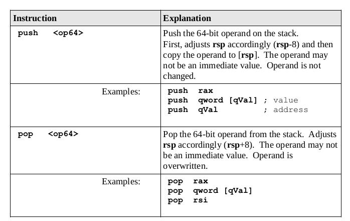

#### `Process Stack`
- A stack is a data structure where items are added and then removed in reverse order(LIFO - last in, first out)
- Used heavily in programming for storage of information during procedure or function calls

#### `Stack Instructions`
- Adding an item to stack is **push** while removing an item from array **pop**
- General format for this instructions is:
```
push <operand64>
pop  <operand64>
```
- operand can be a register or a memory
- Since architecture is x64, we will push and pop quadwards


#### `Stack Implementation`
- **rsp** register is used to point to current top of stack in memory
#### stack Layout

- Heap stores dynamicaly allocated data when requested e.g. items created with **malloc()** in C
- Heap grows upward since data is allocated at runtime, but stack starts in high memory and grows downwards
- **large problem or recursive function will tend to use a lot of stack space**
- If stack and heap meet, program will crash due to memory being no longer available
#### `Stack Operations`
- pop and push operations adjust stack point register(rsp).
#### 1. push operations
- operand is copied to the stack at rsp
- rsp register is decreased by 8 (1 quadward)
- operand is not altered, order of this operations is important
#### 2. pop operations
- current top of stack, at [rsp], is copied into the operand
- rsp register is increased by 8 (1 quadward)

-code example:
```
mov     rax, 6700 ;also 0x00001A2C
push    rax       
mov     rax, 31   ;also 0x0000001F
push    rax
```

- Program to reverse a list<br>
[Reverse List](./stack.asm)
