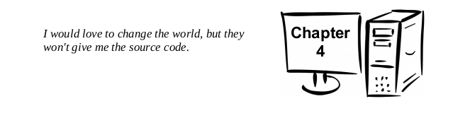

# 100 Days of Hacking RoadMap
This repo will cointain my journey as i learn x86_64bit Assembly...Some stuff i would like to grasp are:

- Writing x86_64bit Assembly

- Reverse engineer compiled programs

- Pawning

- Hope to finally delve into malware analysis and bug bounties later

- Humble Request: Please look into my journey as i will be learning and advice on new methods and techniques that i could use for various problems and stuff...

- Also suggest more resources you may have that i may use in this journey...Also comment on my code...Thankyouuuu...😄😄😊😊

- Looking forwad to learning...

## Task list
### The list below contain set tasks for the 100daysofHacking
- In some cases, i may divert from the task lists for a while for further research on some of the topics.

-  [x] for complete tasks  

-  [ ] for incomplete tasks

# To-Do

  
Intoduction and Architecture Overview

 - [ ] Prequisites

 - [ ] Architecture Overview

 - [ ] CPU

 - [ ] Main Memory

 - [ ] Memory Layout

 - [ ] Memory Hierachy
 

  
Data Representation

  - [ ] Integer Representation
  - [ ] Unsigned and Unsigned Edition
  - [ ] Floating point Representation
  - [ ] Characters and strings

  
Program format

 - [ ] Comments
 - [ ] Numeric Values
 - [ ] Defining Constants
 - [ ] Data Sections
 - [ ] BSS Section
 - [ ] Text Section
 - [ ] Example programs

  
Tool Chain

  - [ ] Assemble/Link/Load Overview
  - [ ] Assembler
  - [ ] Linker
  - [ ] Assemble/Link Scripts
  - [ ] Loader
  - [ ] Debugger

  
DDD

  - [ ] Starting DDD
  - [ ] Program execution with DDD

  
Instruction Set Overview

  - [ ] Notation Convections
    - [ ] Data Movement
    - [ ] Addresses and Values
  - [ ] Conversion Instructions
      - [ ] Narrowing Conversions
      - [ ] Widening Convections
      - [ ] Unsigned Conversions
  - [ ] Integer Arithmetic Instructions
  - [ ] Logic Instructions
  - [ ] Control Instructions
  

  
Addressing Modes

  - [ ] Addresses and Values
  - [ ] Sample Programming

  
Process Stack

  - [ ] Stack Instructions
  - [ ] Stack Implementation
  - [ ] Stack Programming

  
Program Development

  - [ ] Understanding the problems
  - [ ] Creating Algorithms
  - [ ] Implementing Programming
  - [ ] Testing/Debugging programs

  
Macros

  - [ ] Single Line Macros
  - [ ] Multi Line Macros
  - [ ] Macro Examples
  - [ ] Debugging Macros

<detais>
  
Functions

  - [ ] Linking Instructions
  - [ ] Using Debuggers
  - [ ] Stack Dynamic Local Variables
  - [ ] Function Declaration
  - [ ] Standard Calling Convections
  - [ ] Linkage
  - [ ] Argument Transmission
  - [ ] Calling Convection
  - [ ] Stack based local Variables

<detais>
  
System Services

  - [ ] Calling System Services
  - [ ] Newline Character
  - [ ] Console OUtput
  - [ ] Console Input
  - [ ] File Open Operations
  - [ ] File Read
  - [ ] File Write
  - [ ] File Operations Programming

<detais>
  
Multiple source Files

  - [ ] Extern Statement
  - [ ] Interfacing with high level Programming Language(C)

  
Stack BUffer Overflow

  - [ ] Understanding Stack BUffer Overflows
  - [ ] Code to Inject
  - [ ] Code injection
  - [ ] Code injection protections
  #####will delve deeper into buffer overflows and for more sources at this point

<detais>
  
Command Line Arguments

  - [ ] Parsing CLI Arguments
  - [ ] High level Language Example
  - [ ] Argument count and Argument vector table
  - [ ] Program them in Assembly

  
I/O BUffering

  - [ ] Why Buffer
  - [ ] Buffering Algorithm

  
Floating point Instruction

  - [ ] Floating point Values
  - [ ] Floating point Registers
  - [ ] Data Movement
  - [ ] Integer/Floating point Conversion Instructions
  - [ ] Floating point arithmetic Instructions
  - [ ] Floating point Control Instructions
  - [ ] Floating point Calling Convections
  - [ ] Write Floating point assembly programs

  
Parallel Computing

  - [ ] Distributed Computing Introduction
  - [ ] Multiprocessing Introduction
  - [ ] Posix Threads
  - [ ] Race Conditions
  #####will also read more about race Conditions and how to exploit them at this point

  
Interrupts

  - [ ] Multi-user OS
  - [ ] Interrupts types and levels
  - [ ] Interrupts processing
  - [ ] Suspension Interrupt processing summary

